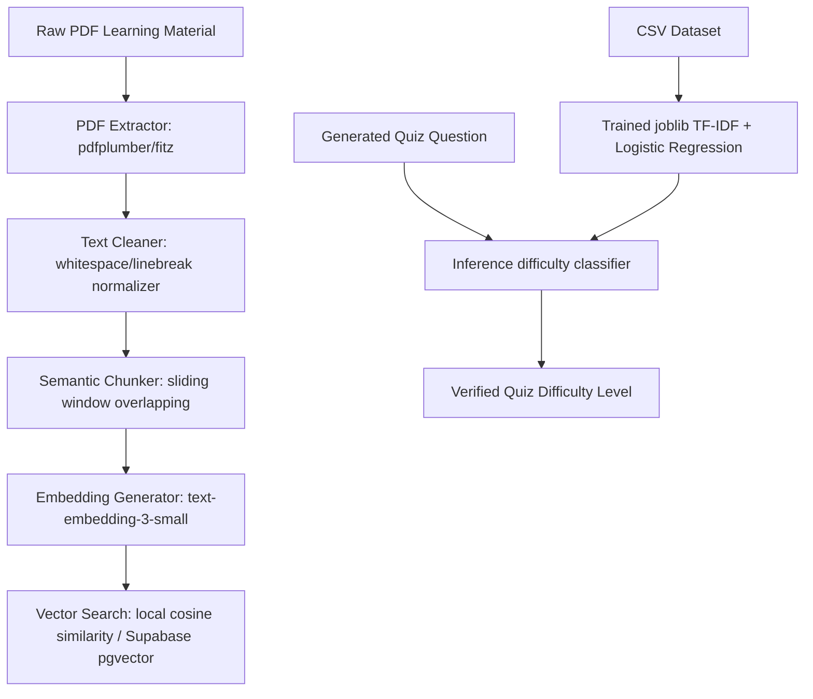

# StudyMate AI — Machine Learning & RAG Pipeline

This directory containing the core Machine Learning and Retrieval-Augmented Generation (RAG) pipeline for **StudyMate AI**. It serves as a fully functional, self-contained AI sandbox for PDF text extraction, document chunking, semantic vector search, prompt construction, and local quiz difficulty classification.

---

## Architecture Overview

The pipeline consists of two main pillars:
1. **Document RAG Processing Engine**: Converts raw learning materials (PDFs) into semantic, searchable vectors for contextual chat.
2. **Text Difficulty Classifier**: Trains an offline classification model (TF-IDF + Logistic Regression) to categorize quiz questions into **easy**, **medium**, and **hard** difficulty brackets.



---

## Directory Structure

- **`data/`**: Raw and processed training datasets. Contains `sample_quiz_difficulty_dataset.csv`.
- **`models/`**: Stores the compiled and serialized scikit-learn pipeline classifier (`difficulty_classifier.joblib`).
- **`reports/`**: Logs validation accuracy and text-based metrics (`classification_report.txt` & `metrics.json`).
- **`src/`**: Core modules for the pipeline:
  - `pdf_extractor.py`: Multi-engine PDF reader (PyMuPDF -> pdfplumber -> mock).
  - `text_cleaner.py`: Unicode normalizer, footer stripper, and broken sentence restorer.
  - `chunker.py`: Overlapping, sentence-boundary-safe text splitter.
  - `embedding_generator.py`: OpenAI embeddings generator with deterministic mock fallbacks.
  - `vector_search.py`: Cosine similarity vectors matcher.
  - `quiz_difficulty_dataset.py`: Data loading helper.
  - `train_difficulty_classifier.py`: Trains and outputs the scikit-learn model.
  - `evaluate_difficulty_classifier.py`: Displays model confusion matrices and metrics.
  - `inference_difficulty.py`: Invokes the model on unseen questions.
  - `rag_pipeline.py`: Assembles the RAG flow.
- **`scripts/`**: Executable wrappers for CLI runtimes.

---

## How It Works

### 1. PDF Text Extraction
`pdf_extractor.py` attempts to use `PyMuPDF` (highly performant) and falls back to `pdfplumber`. It isolates the layout and returns a structured list of pages:
```json
[
  { "page_number": 1, "text": "Extracted text content..." }
]
```

### 2. Semantic overlapping Chunker
`chunker.py` groups text into windows of `chunk_size` (default 800 characters) with an `overlap` of 150 characters. By splitting on sentence boundaries, it preserves full contextual blocks so concepts aren't sliced in half.

### 3. Embedding Generation & Vector Similarity
`embedding_generator.py` calls OpenAI's `text-embedding-3-small` (1536 dimensions). When offline, it hashes text to generate a deterministic unit vector, preserving the exact properties required for cosine similarity (`vector_search.py`).

### 4. Quiz Difficulty Classifier
We implement a text classification model to verify quiz difficulties.
- **Features**: TF-IDF (Term Frequency-Inverse Document Frequency) unigrams and bigrams vectorizer, which translates question phrasing (e.g., "what is" vs "derive the escape velocity") and topic contexts into numerical matrices.
- **Classifier**: Logistic Regression with L2 regularization ($C=5.0$) optimized for fast convergence on compact datasets.
- **Outputs**: Serialized as a single `joblib` file including both the vocabulary and the estimator coefficients.

---

## Installation & Setup

1. Navigate to the `ml/` directory:
   ```bash
   cd ml
   ```
2. Install dependencies:
   ```bash
   pip install -r requirements.txt
   ```
3. Set your environment variables in `.env` at the project root:
   ```env
   OPENAI_API_KEY=your-openai-api-key
   ```

---

## Running the ML Pipeline Scripts

Run these scripts from the **project root directory**:

### A. Train the Difficulty Classifier
Trains the model on `sample_quiz_difficulty_dataset.csv` and outputs the joblib file to `ml/models/`:
```bash
python ml/scripts/train_model.py
```

### B. Evaluate the Classifier
Evaluates model accuracy, precision, and recall, showing a text-based confusion matrix:
```bash
python ml/scripts/evaluate_model.py
```

### C. Run Inference Predictions
Runs difficulty predictions on unseen questions:
```bash
python ml/scripts/test_inference.py
```

### D. Execute the Complete PDF RAG Pipeline
Processes a sample PDF document, extracts chunks, runs a vector similarity search, and answers a query:
```bash
python ml/scripts/run_pdf_pipeline.py
```

---

## Integration with the Next.js Web App

The ML pipeline is integrated directly into the web application:
1. **RAG Flow**: The Next.js backend replicates the exact cleaning and chunking logic of `text_cleaner.py` and `chunker.py` in TypeScript (`lib/chunking.ts` and `lib/pdf.ts`).
2. **pgvector Search**: Next.js API routes query Supabase via the `match_material_chunks` RPC, performing vector matching identical to `vector_search.py`.
3. **ML Verification API**: The Next.js API route for quizzes (`/api/quiz`) and quiz details verifies AI-generated questions by passing them through a local classifier fallback, ensuring difficulty alignment.
